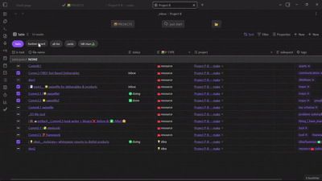
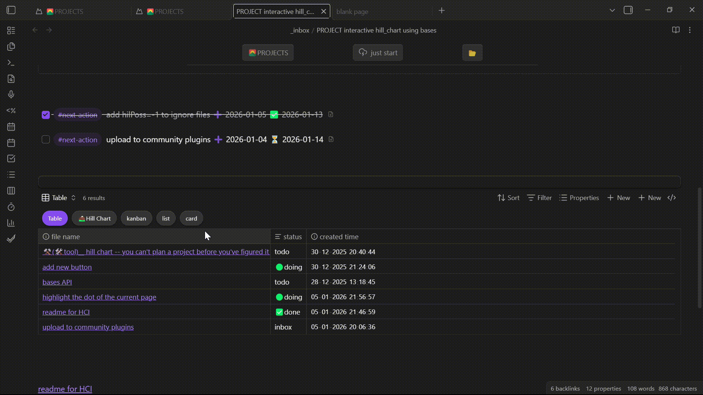
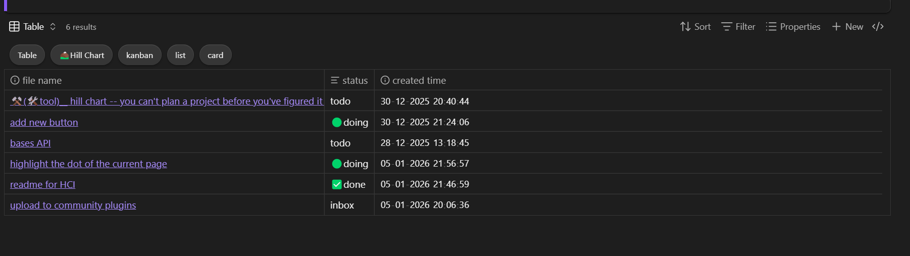

# Bases View Tabs (Obsidian Plugin)

Adds **pill-style tabs** for switching between views in **Obsidian Bases**, both for:

* native `.base` files (real Bases views)
* embedded ` ```base ` blocks inside Markdown notes







---

## What this plugin does

* Renders a row of **pill tabs** above a Bases view
* Each tab maps directly to a Base **view name** (Table, List, custom views, etc.)
* Clicking a tab switches the active view immediately
* Works consistently for:

  * standalone `.base` files
  * embedded Bases inside Markdown previews

---

